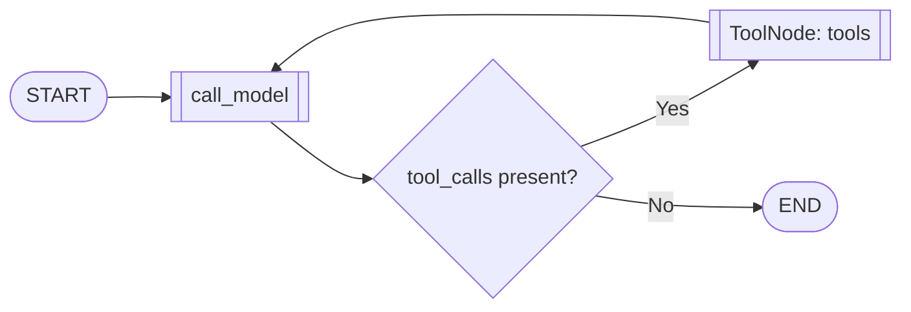

# LangGraph + MCP Image Generation

A minimal demo that wires a **single MCP server** as a **tool** inside a **LangGraph** agent to generate images (using OpenAI Images API). Returns both an **MCP image block** and a **PNG file saved locally**.


## Highlights

- **One server, one tool:** MCP server `ImageGen` exposing `generate_image`.
- **Always works:** If `OPENAI_API_KEY` is missing, falls back to a **Pillow** placeholder.
- **Simple graph:** `MessagesState` + `ToolNode` + minimal conditional edges, with `MemorySaver`.
- **Saved assets:** Images written to `./generated/` with safe filenames.

## Architecture Overview



## Project Structure

```
.
├─ agent_graph.py        # LangGraph agent that loads the MCP tool and calls it
├─ image_server.py       # MCP ImageGen server (async, with progress updates)
└─ generated/            # Output folder for PNGs (auto-created)
```


## Prerequisites

- Python **3.10+**
- (Optional) An **OpenAI API key** (`OPENAI_API_KEY`) if you want real image generations. Without it, the demo still works using a local Pillow placeholder.


## Installation

```bash
pip install "mcp[cli]" langchain-mcp-adapters langgraph langchain openai pillow
```

## Configuration

Environment variables:

- `OPENAI_API_KEY` — optional; enables OpenAI Images (`gpt-image-1`).
- `LANGSMITH_API_KEY` — optional; enables LangSmith tracing.
- `LANGSMITH_TRACING_V2` — optional; enables LangSmith tracing.
- `LANGSMITH_PROJECT` — optional; enables LangSmith tracing.

## Running

#### Option A — Spawn the MCP server automatically (recommended)

`agent_graph.py` starts the MCP server via `MultiServerMCPClient` using `stdio`.

```bash
python agent_graph.py
```

#### Option B — Run the MCP server yourself (advanced)

Start the server in one terminal and point the client to it (when using HTTP transport). For `stdio`, this is generally unnecessary, but you can still run it to see logs:

```bash
python image_server.py
```

Then run the agent in another terminal.

#### Result


